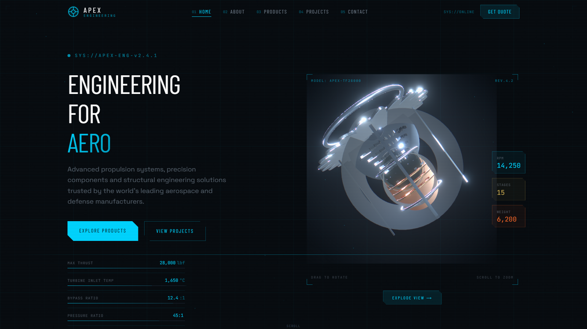
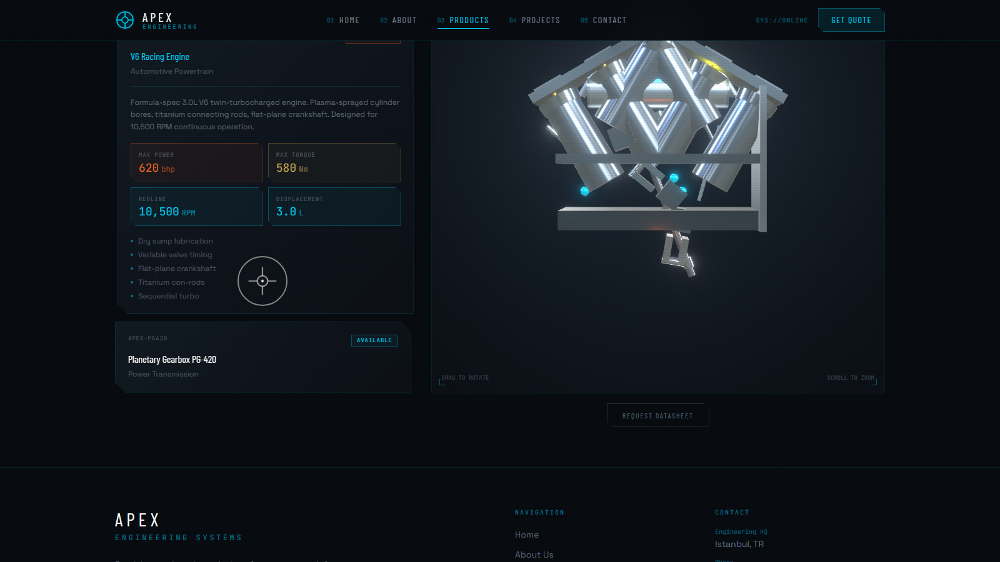

# Apex Engineering

A showcase site for an engineering firm, built around three machines you can turn over in the browser: a turbofan, a V6 racing engine and a planetary gearbox. None of them is a downloaded model. Each one is assembled in code from primitive shapes.

**Live:** https://apex-engineering-two.vercel.app/



Apex Engineering is not a real company. I trained as a mechanical engineer before I moved to software, and this is a concept project: I wanted to see how far a product page could go when the product is drawn by somebody who knows what the parts are. The firm, its projects and every figure on the site are made up for the showcase.

## What it does

- **Three models, drawn in code.** `TurbofanEngine` has a spinner, an inlet lip, fan and compressor stages and a core cowl. `PistonEngine` is a 60° V6 with moving pistons. `GearAssembly` is a planetary set: sun, planets and ring turning at the ratios they would really turn at.
- **Orbit and inspect.** Drag to rotate, scroll to zoom. The products page puts each machine beside its specification sheet.
- **A products page** with three entries (TF-28000 Turbofan, V6 Racing Engine, Planetary Gearbox PG-420), each with four headline figures.
- **A projects page** with six case studies, from VTOL propulsion to an armoured vehicle's suspension, each with three outcomes.
- **About and contact pages.** The contact form checks its fields before it sends, and posts to FormSubmit.
- **A blueprint look**: a drafting grid behind the pages, cyan line work, counters that run up as they scroll into view, and page transitions.



## Stack

- React 18 and Vite
- Three.js through React Three Fiber, with drei for controls and loading, and postprocessing for bloom
- React Spring for motion inside the 3D scenes, Framer Motion for the pages
- React Router 6
- Tailwind CSS 3

## Run it

Node 18 or newer.

```bash
npm install
npm run dev
```

Then open the address Vite prints, usually `http://localhost:5173`.

```bash
npm run build      # the production build, into dist/
npm run preview    # serve that build locally
```

There are no environment variables.

## Layout of the code

```
src/
  App.jsx                 routes, the navigation bar, the cursor, page transitions
  pages/                  Home, Products, Projects, About, Contact, NotFound
  components/
    3d/                   TurbofanEngine, PistonEngine, GearAssembly, ModelLoader
    ui/                   BlueprintGrid, SectionHeader, StatCounter, TechBadge, PageTransition
    Navbar.jsx  Footer.jsx  CustomCursor.jsx
  index.css               Tailwind layers and the few global rules
public/                   the favicon and the share image
ss-*.png                  screenshots of the pages
vercel.json               sends every path to index.html, so a deep link loads
```

## Deploying

It is a static site. On Vercel the defaults work: the build command is `npm run build` and the output folder is `dist`. `vercel.json` adds the rewrite a single-page app needs.

## Notes

- The models are heavy for a phone. They load behind a progress ring, and the page under them is readable before they arrive.
- The contact form sends real mail through FormSubmit, to the address set at the top of `src/pages/Contact.jsx`. Change it before reusing the project.

## Author

[Canberk Yıldız](https://canberkyildiz.netlify.app)
